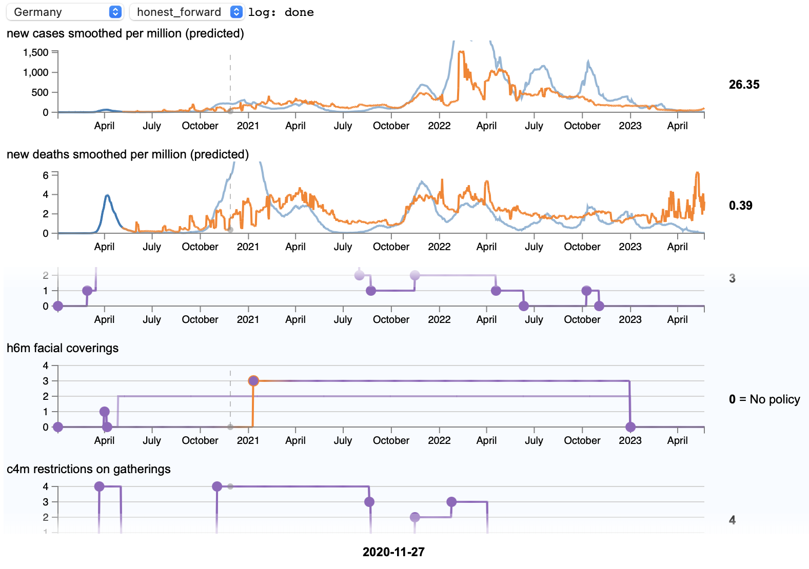
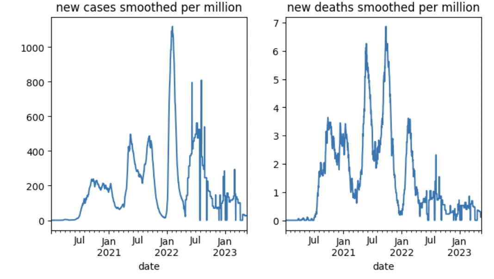
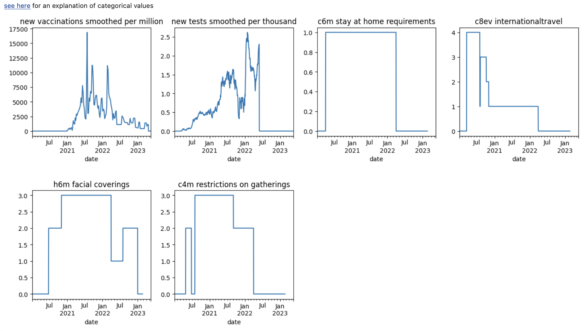

# 1-page report

## Motivation

To this day, the political landscape in almost all western civilizations suffers from an (understandable but unfortunate) divide with regard to the Covid-19 measures and their trade off between positive and negative consequences.

This web app lets the user play government with the benefit of hindsight: For a selection of a few regions/countries did the standardized government measures such as lockdown times, border closing, vaccinated persons or mask mandates have a noticeable effect on outcomes like cases, deaths, hospitalizations and mortality rate? The question can be explored in an interactive setting.

Our focus is on providing a frontend for modifying Covid-19 measurement data and answering counterfactual questions based on a model which can be switched at runtime. Training such models for Covid-19 data itself is of secondary interest, since it is difficult enough on its own and is expected to require domain knowledge. It is a design goal to exhibit a minimal, responsive and intuitive interface which could be used by policy makers.

*Example use of webapp*

## Challenges

### Data selection and processing

For outcomes (cases, deaths, etc.), we used the OWID (Our World in Data) Covid-19 data due to its good goverage spatially and temporally. For measures, we first tried using the ACAPS Covid-19 dataset which contains detailed textual information about measures in some countries. Ultimately, it was a) too cumbersome to reliably extract numerical information from text with ChatGPT b) providing too little coverage (spatially and temporally). We then found the OxCGRT (Oxford Covid Government Response Tracker) repository, which conveniently provides numerical information, but it took about 2 days of work to read through the documentation and understand which parts of the data we could (and should) use for our project. For example, we decided to focus on nation-wide measures, which requires masking the provided measure data with another so-called *flag* file. We then joined OWID and Oxford into a single set of time series for each country of interest. NaN-handling was fairly trivial by cropping and very few singular forward fills. For training, categorical columns need to be converted to dummy binary columns.

*Costa Rica Outcomes*

*Costa Rica Measures*

See `compute_data_for_country.py`, `categorical_to_dummy.py`, `get_oxford_categorical_flagged.py`, `get_oxford_df.py`

### Modeling

Time series data can be learned via lagged sliding windows. We started out with a somewhat novel counterfactual approach of learning different rank-deficient relationships between the left and right window (see details in `ensemble.py` and `train_ensemble_h.ipynb`) and employing a least-squares based predicition scheme. However we were advised against this approach by Christoph since the validation was (correctly) anticapted to be a bit unorthodox. Reusing the weak learners from the above ensemble, we first tried a linear model with standard forward prediction. This proved very unstable in low-evidence (or low-confidence) regions, i.e. predicition on its own output would lead to unbounded values quickly if the slightest error is introduced. We fixed this problem using a random/bagged forest which does exhibit exploding predictions. (this last model is called `honest_forward`)

See `train_weak_learner.py`, `window_patches.py`

### Webapp

For the web app, we use a SocketIO (flask) server in python and a pure HTML5 frontend with D3. Development was rather a breeze since most of the problems could be solved by ChatGPT 4.0, which has excellent knowledge of D3 and JS. We show outcomes at the top and overlay the current measure (trigger by hover) for clarity. All series can be modified with handles (no effect for outcomes currently) which behave differently for categorical and continous data (click to add a handle, press x/backspace to remove one, escape to unselect). At the bottom, we show a scrollview with all the measures so the outcomes stay in sight. In the very bottom there is some model information about the current model (supports LaTeX). Regions and models can be selected at the top. The models have a plug-in interface, so more models could be added and switched at runtime. Since predictions take quite long, it was challenging to determine when (in terms of user interactions) and where (in terms of where to start the prediction) we should run the prediction, which was solved with an automatic (yet admittedly subobptimal) heuristic algorithm split between browser and python: Because of the browser implementation, slight modifications creep into the data which need to be detected and ignored, so detecting where the data actually, substantially changed was quite involved especially for categorical data. The server employs a lot of caching to speed up subsequent user requests.

See `static/index.html`, `static/graph.js` and `server.py`

### Data cleaning

Originally we had planned to include hospitalization data as an outcome, but few countries provided that which would restrict us to only train on a small set of countries. Using all the 180 possible countries (the intersection of OWID and Oxford) did also not work, since many countries had unclean data (see detais in `countries_known_to_be_broken.py` ). So we had to plot all outcomes of measures of every single country and manually filter to protect our model from eating garbage. We also tried manual selection with a more aggressive filter (selecting only countries our model would be able to fit well in the training data) and split them into a European and American cluster, but this ultimately removed too much training data to generalize. We noticed that the model generally only performs acceptably well in western/European/industrialized countries (have we discovered a [WEIRD bias](https://en.wikipedia.org/wiki/Psychology#WEIRD_bias) in Covid-19 data?) and for data outside that category arbitrarily bad performance has been observed. We leave the interpretation open to the reader.

### Evaluation

Since models are trained on windows, it would be too easy (and questionable) to output the window-based generalization score (about 0.92 R2), since this is not directly our object of interest. We generalized the concept of R2 score (coefficient of determination) for time series (using only the true and predicted outcome series). This yields two problems: a) if the predictor has low smoothness, it could oscillate around the truth and still produce a large squared error b) early drift in the predicted time series is penalized too much, i.e. if the predicted curve is an offset of the thruth it accumulates a large squared error for a single mistake at the beginning. These problems are difficult to formalize and mitigate in an automated way. We tried testing smaller prediction windows, but here we find ourselves again in an uphill battle since the mean baseline in the R2 score for smaller windows becomes increasingly hard to beat. Thus evaluation metrics need to be taken with a grain of salt. Luckily one can always visually inspect test set predictions. The variance of the evaluation metric estimator is also a large problem, since it seems to depend largely on how many of the WEIRD countries are in the test set. One could solve this problem with rebalancing (i.e. the WEIRD fraction in train and test needs to be equal).

For our `honest_forward` model, using a train/test split of 80/20 over the manually cleaned dataset (see above), 24% of the countries predicted out-of-sample achieve a positive R2 score.

")
*Predicition for Germany (in-sample)*
")
*Predicition for India (out-of-sample)*

See `predict_h.ipynb`